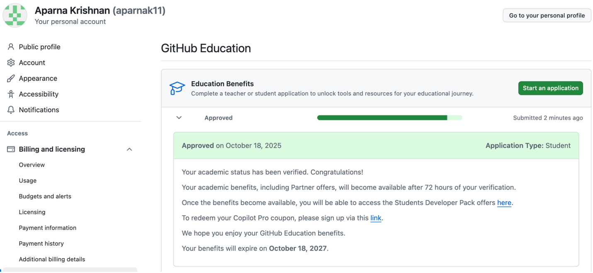

# hello-world
This repository is for practicing the GitHub Flow.

I am a senior ASTE student at USC, practicing my GitHub skills!

Just testing out the copilot commit message!

---

# ASTE 404- Homework #4
Aparna Krishnan
## Part 1
a)

- will be sure to access the student developer pack once benefits become available

c) *Was there ever an assignment or project where version control would’ve been helpful?*

Version control is essential in terms of seeing a change log to the code. I think this would have been very helpful when I was working on some very long MATLAB code and I could see when and why I made the changes I did.

f) There was an issue with authentication failure when trying to do “git push origin main”. Workaround was to create an access token through GitHub. Had ChatGPT walk me through the steps for creating an access token.

---
That error appears because GitHub no longer supports password authentication for Git operations. You now have to use either:
✅ Option 1: HTTPS with a Personal Access Token (PAT)
1.	Go to your GitHub → Settings → Developer settings → Personal access tokens → Tokens (classic).
2.	Click Generate new token → classic.
3.	Give it a name like “MacBook Git”.
4.	Check these scopes:
o	repo (for private/public repo access)
o	read:org
5.	Copy the generated token — you won’t see it again.
Then, in your terminal:
git clone https://github.com/aparnak11/hello-world.git
Username for 'https://github.com': aparnak11
Password for 'https://aparnak11@github.com': <paste your token here>
💡 Tip: You can cache it so you don’t have to re-enter:
git config --global credential.helper store
Then enter the token once; it’ll be remembered.
 
✅ Option 2: Use SSH authentication (recommended long-term)
1.	Check if you already have SSH keys:
2.	ls -al ~/.ssh
If you don’t see id_ed25519.pub or id_rsa.pub, generate one:
ssh-keygen -t ed25519 -C "your_email@example.com"
Press Enter through defaults.
3.	Start the SSH agent and add your key:
4.	eval "$(ssh-agent -s)"
5.	ssh-add ~/.ssh/id_ed25519
6.	Copy your public key:
7.	pbcopy < ~/.ssh/id_ed25519.pub
Then paste it under GitHub → Settings → SSH and GPG keys → New SSH key.
8.	Clone using SSH:
9.	git clone git@github.com:aparnak11/hello-world.git
 
Would you like me to walk you through setting up the token or the SSH method (recommended for long-term use on your Mac)?

---
g) *Some helpful VS Code + Git notes:*

Save the file, then you can have Copilot write the commit message for your staged change and then hit the commit button, which will lead you to the push button.

